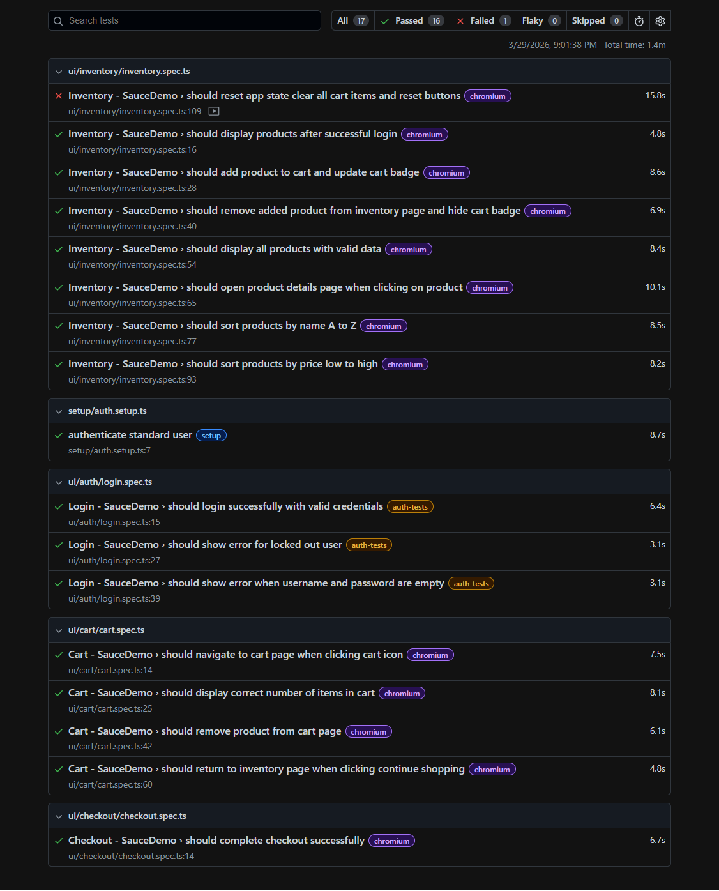
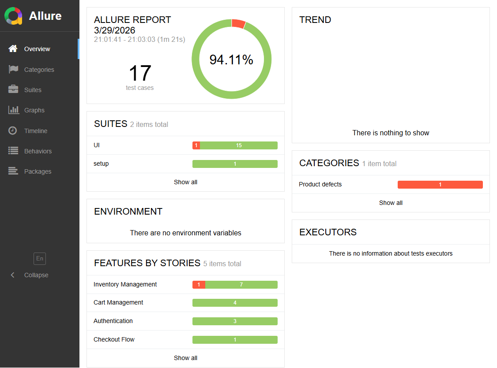
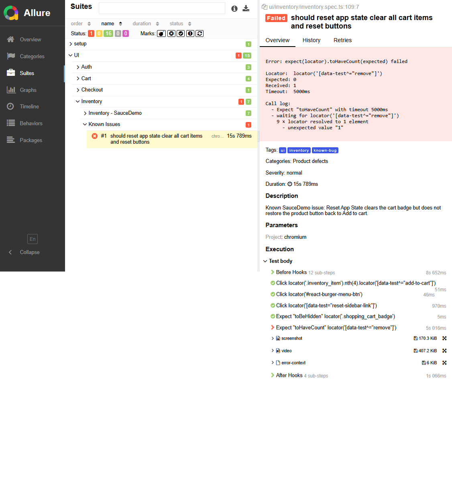

# Playwright SauceDemo Automation Framework

A professional UI test automation framework built using **Playwright + TypeScript**.

This project demonstrates a clean and scalable automation architecture using:
- Page Object Model (POM)
- Custom Fixtures
- Auth setup with storage state
- Allure reporting with structured metadata
- Playwright HTML reporting

---

## 🚀 Project Overview

This framework automates key user flows in the SauceDemo application:

- Authentication (Login)
- Inventory (Products)
- Cart Management
- Checkout Flow

It is designed to showcase best practices in UI test automation.

---

## 🧱 Tech Stack

| Tool | Purpose |
|------|---------|
| Playwright | Browser automation |
| TypeScript | Typed scripting language |
| Allure Report | Rich test reporting |
| Node.js | Runtime environment |

---

## 🏗️ Architecture

### 🔹 Page Object Model (POM)

Each page is abstracted into a class:

| Class | Page |
|-------|------|
| `LoginPage` | Login screen |
| `InventoryPage` | Products listing |
| `CartPage` | Shopping cart |
| `CheckoutPages` | Checkout flow |

---

### 🔹 Fixtures

Custom fixtures are used to inject page objects:

```ts
loginPage
inventoryPage
cartPage
checkoutStepOnePage
checkoutOverviewPage
checkoutCompletePage
```

---

### 🔹 Authentication Handling

- Login executed once in `auth.setup.ts`
- Session saved using `storageState`
- Reused across all authenticated tests

---

### 🔹 Project Structure

```
tests/
  ui/
    auth/
    inventory/
    cart/
    checkout/

src/
  pages/
  fixtures/
  utils/

setup/

docs/
  screenshots/
    playwright-report.png
    allure-report.png
```

---

## 📊 Reporting

### ✅ Playwright HTML Report

```bash
npm run report:playwright
```

### 🔥 Allure Report

```bash
npm run report:allure
```

### 🧠 Allure Metadata

Each test is enriched with:

- `parentSuite` / `suite` / `subSuite`
- `feature` / `story`
- Severity levels
- Tags
- Description

---

## 🐞 Known Issues

### Reset App State Bug

| Behavior | Status |
|----------|--------|
| Clears cart badge | ✔️ Works |
| Reset app state clear all cart items and reset buttons | ❌ Bug |

> 📌 This test is **intentionally kept failing** to demonstrate:
> - Bug detection
> - Real test validation
> - Reporting transparency

---

## ▶️ How to Run

**1. Install dependencies**
```bash
npm install
```

**2. Run tests**
```bash
npm test
```

**3. Clean & run**
```bash
npm run test:clean
```

---

## 📷 Reports Preview

### Playwright Report


### Allure Report


### 🐞 Reset Bug — Intentional Failing Test


---

## 📁 Project Scripts

| Command | Description |
|---------|-------------|
| `npm test` | Run all tests |
| `npm run test:ui` | Open Playwright UI |
| `npm run test:headed` | Run in headed mode |
| `npm run report:playwright` | Open Playwright report |
| `npm run report:allure` | Open Allure report |
| `npm run test:clean` | Clean + run |

---

## 🚀 Future Improvements

- [ ] CI/CD (GitHub Actions)
- [ ] API testing integration
- [ ] Parallel execution optimization
- [ ] Test data management
- [ ] Retry & flakiness handling

---

## 👨‍💻 Author

**Ahmed Saied**
Junior Software Tester | UI Automation (Playwright)

---

## ⭐ Notes

> This project reflects my transition from manual testing to professional automation engineering.